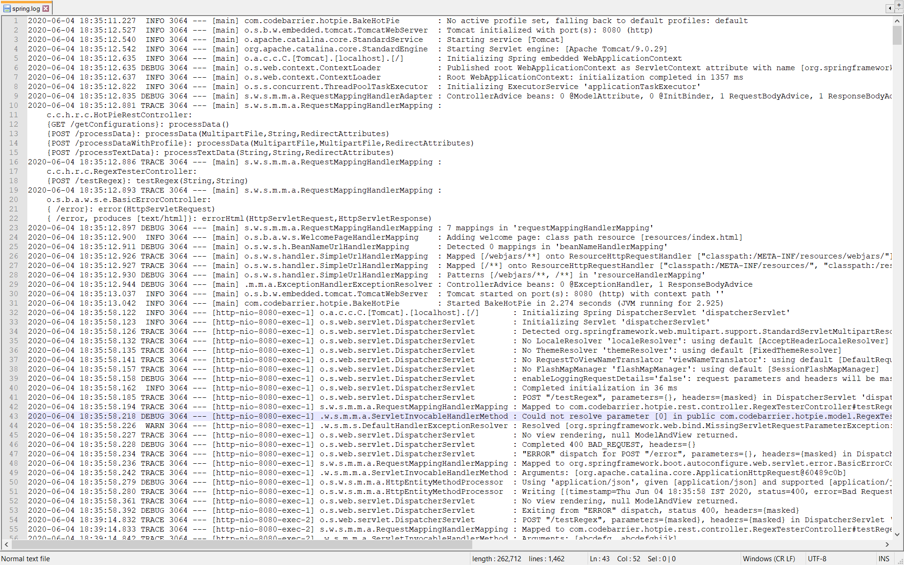
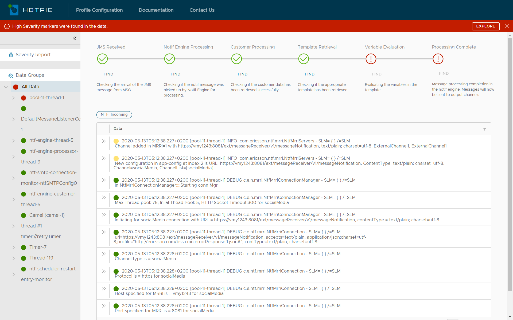

# H O T P I E -  Data Organizer 
---
[Hotpie HQ](https://hotpie.tech "https://hotpie.tech")
---
### A solution for interpretting and organizing the contents of your data files for easier analysis and troubleshooting.

Organizing _**RAW**_ data into managable information using
  * Custom Line Delimiter
  * Filters
  * Groups
  * Highlights
  * Checkpoints
  * Pin Boards
  * Data Unit Severity Assignment
  * Severity Reports

### Getting Started
* You need to have Docker. Install Docker Engine and Docker compose first.
* Setup the Application : There are two ways to get this done
  * Clone the repo and build hotpie-ui and hotpie-server projects individually using `docker build`. The docker images for hotpie-ui and hotpie-server will be available in the local cache. Execute 'docker compose up' on the root directory of the project.
  * Download the [docker-compose.yaml](https://github.com/codebarrier/hotpie/releases/download/3.0.0/docker-compose.yaml "Hotpie Docker"). Once the file is available, execute `docker compose up` to start up the application.

The default port is taken as 8080
---
### Raw Data

---
### Organized Data

---
